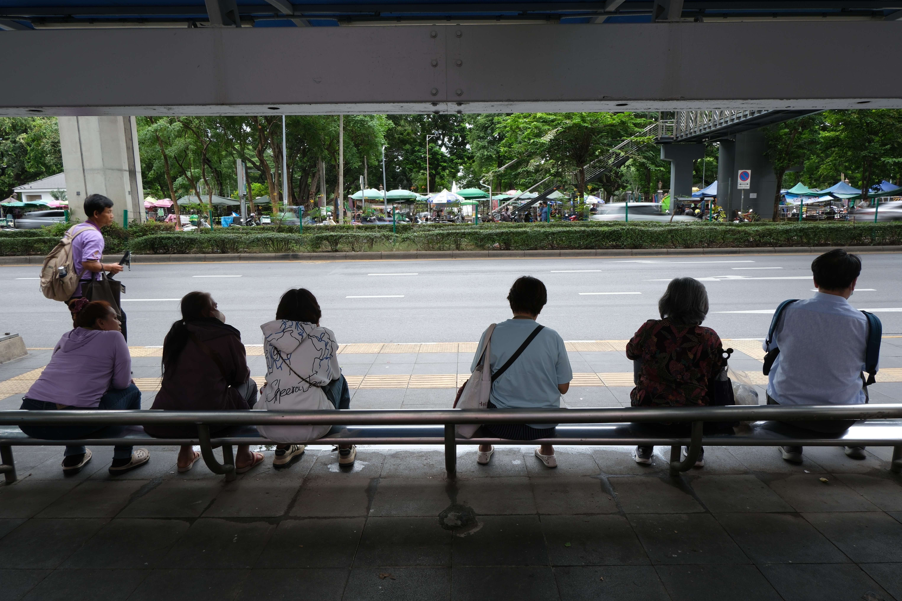

  

    

      

        
      

      

        
      

      

        
      

    

    <button class="carousel-control-prev" type="button" data-bs-target="#myCarousel" data-bs-slide="prev">
      
    </button>

    <button class="carousel-control-next" type="button" data-bs-target="#myCarousel" data-bs-slide="next">
      
    </button>

  

